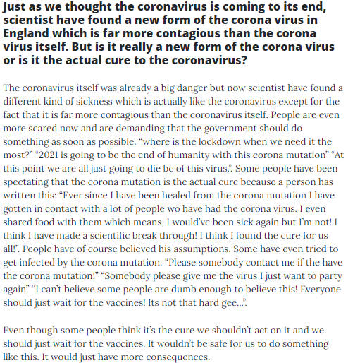

+++
title = " 𝔹𝕣𝕚𝕥𝕚𝕤𝕔𝕙𝕖 𝕄𝕦𝕥𝕒𝕥𝕚𝕠𝕟 𝕖𝕚𝕟 ℍ𝕖𝕚𝕝𝕞𝕚𝕥𝕥𝕖𝕝?"
date = "2021-01-13"
draft = true
pinned = false
image = "britische-mutation-1-.png"
+++
Heute haben Andrin und ich im Unterricht wie immer einen neuen Eintrag geschrieben. Der heutige Eintrag war: British corona mutation (B.1.1.7) is the actual cure for the corona virus?

Zusätzlich haben wir einen Instagram und Twitter account gemacht! ihr könnt uns jetzt unter: notimesfake auf instagram und auf twitter unter notimes4