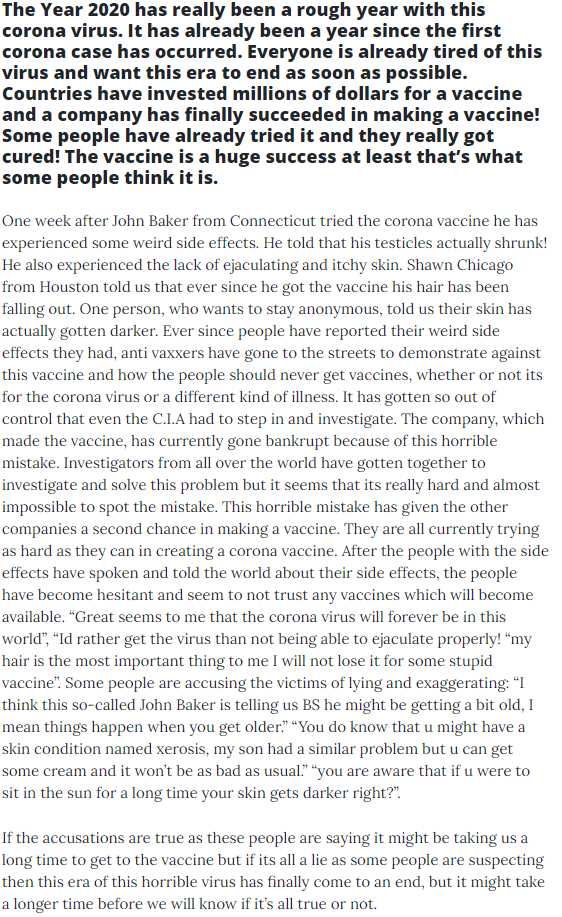

+++
title = "ℂ𝕠𝕣𝕠𝕟𝕒 𝕀𝕞𝕡𝕗𝕤𝕥𝕠𝕗𝕗 𝔼𝕚𝕟𝕥𝕣𝕒𝕘"
date = "2020-12-16"
draft = false
pinned = false
image = "vaccine.webp"
+++
Im heutigen Unterricht haben wir in der ersten Lektion zusammen besprochen was wir in der letzte Woche gemacht haben und was wir heute noch machen werden. Währendem Andrin weiter an unsere Website gearbeitet hat, habe ich einen neuen Eintrag geschrieben. Zudem haben wir jetzt unsere eigener Twitter account und noch viele mehr. Hier könnt ihr alle den neuen Eintrag lesen. Nächste Woche werden wir weiterhin an unserer Website arbeiten und neue Einträge schreiben.

