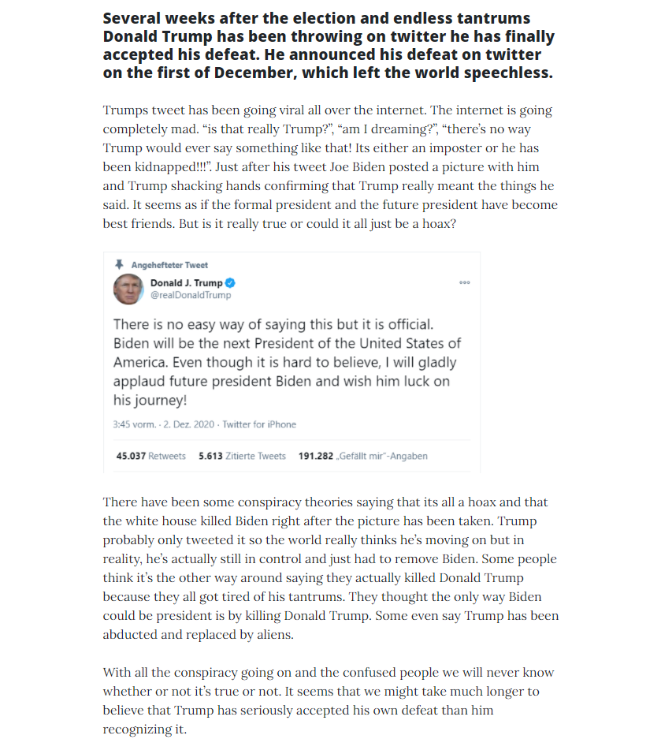

+++
title = "𝔼𝕣𝕤𝕥𝕖𝕣 𝔼𝕚𝕟𝕥𝕣𝕒𝕘 𝕗ü𝕣 ℕ𝕠𝕥𝕚𝕞𝕖𝕤"
date = "2020-12-02"
draft = false
pinned = false
image = "notimes-website.png"
+++
*   In der ersten Hälfte der Lektion Marko mit uns nochmals besprochen wie wir es genau machen sollten mit der Note. Währenddem habe ich noch ein bisschen auf Gimp geübt Bilder zu fälschen. Dieses könnt ihr hier sehen:

  

  Nachdem ich das Bild fertig gemacht habe, haben Andrin und ich zusammen besprochen wie es weiter gehen sollte. Wir sind uns danach einig geworden unseren ersten Eintrag zu machen und unsere Website endlich zu formatieren. Wir haben also zusammen auf Word ein paar Ideen gesammelt und haben uns entschieden, dass ich einen Text formatieren sollte und dass Andrin unsere Website formatieren wird. Während dem Unterricht habe ich zum Thema "Trump erkennt seine Niederlage" einen Eintrag auf Englisch geschrieben. Dies fiel mir nicht einfach, da ich lange brauche bis ich in "den flow" herein komme. Jedoch ist es für mich definitiv einfacher einen Text auf Englisch zu formatieren anstatt auf Deutsch, da mir die Sätze auf Englisch schneller und besser in den Sinn komme. Somit habe ich einen Eintrag auf englisch geschrieben und diesen danach auf deepl übersetzt und noch überarbeitet.

  