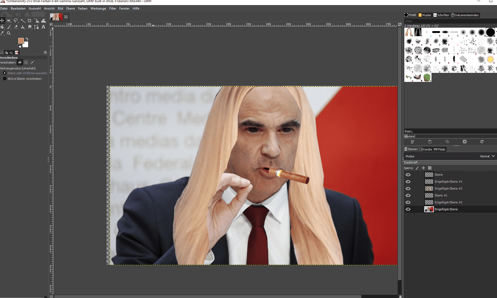

+++
title = "𝔾𝕀𝕄ℙ"
date = "2020-11-18"
draft = false
pinned = false
image = "gimp2.png"
+++
Im heutigen Unterricht konnten Andrin und ich das Turtorial zum Programmieren endlich abschliessen. Nachdem wir das abgeschlossen haben, haben wir uns entschieden das Photoshopping mal anzuschauen. Dieser Bereich war noch ziemlich neu für mich, da ich noch nie mit einem Programm photoshopped habe. Ich musste mich also im Internet erkundigen. Da Andrin schonmal Bilder bearbeitet hat, konnte er mir helfen. Dies haben wir alles auf dem Programm GIMP gemacht. Ich konnte also schon ein Bild bearbeiten. 

