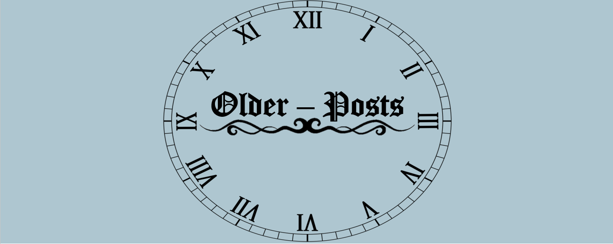
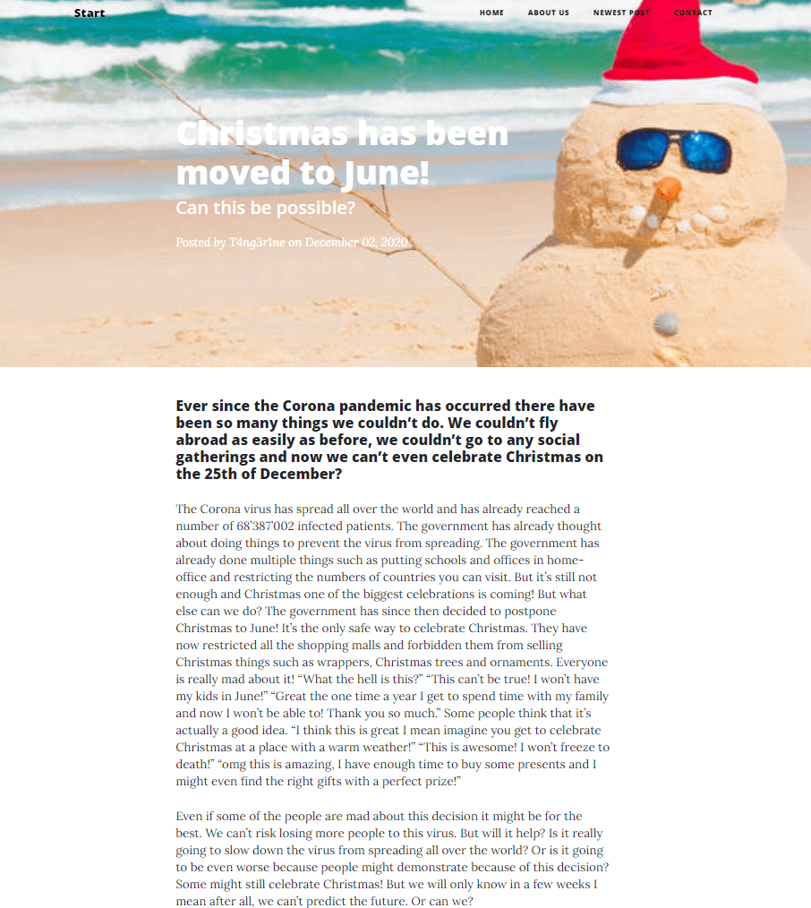

+++
title = "No-Times"
date = "2020-12-09"
draft = true
pinned = false
image = "no-times.png"
+++
In der heutigen Lektion konnten Andrin und ich viele Sachen unternehmen. Währenddem Andrin noch weiter an der Website programmiert hat, habe ich 2 Logos erstellt. Das erste ist unser offizielles Logo von unserer Website. Das zweite Logo welches ich erstellt habe ist eines, für eine zwischen Ablage von unserer Website. 

Bei diesem habe ich mir gedacht könnte ich es ähnlich machen wie unser originales Logo. Ich habe mir bei der Uhr jedoch gedacht, da es older posts sind kann es eine ältere Uhr sein, deshalb habe ich die Römischen Zahlen ausgewählt. Nachdem ich dies gemacht habe, habe ich zusammen mit Marco meine Note besprochen und habe mich entschieden eine 6 zu geben ,welches er auch unterstütz hat. Nachdem habe ich den neuen Eintrag für unsere Website eingetragen welches ihr hier findet könnt:

