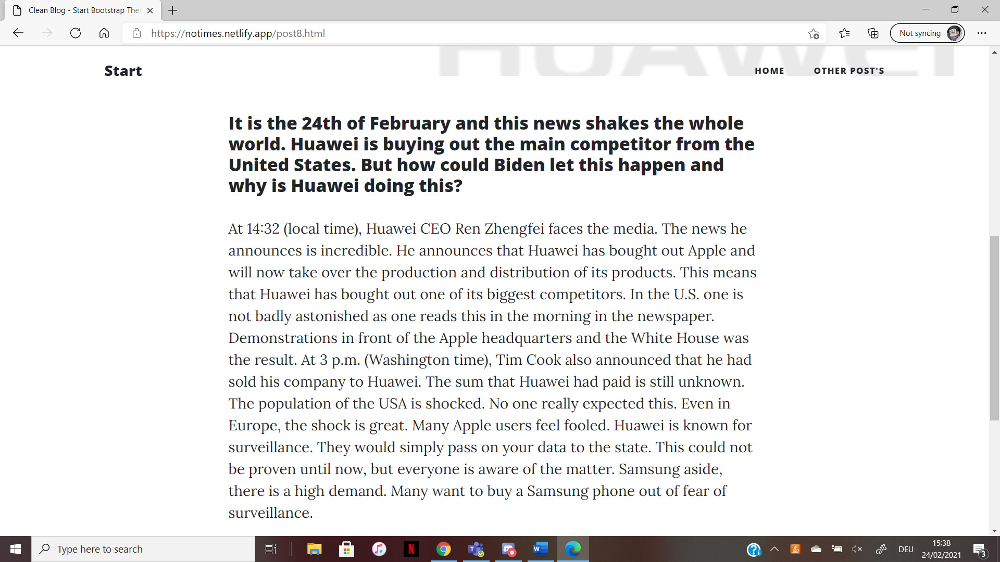

+++
title = "𝕌𝕟𝕚𝕥𝕪"
date = "2021-02-24"
draft = false
pinned = false
image = "lego.jpg"
+++
In unserer heutigen Stunde haben Andrin und ich angefangen Unity zu benutzen. Bevor wir überhaupt anfangen konnten ein Spiel zu erstellen, mussten wir das Programm kennenlernen, indem wir einem Turtorial folgten. Wir folgten einem, welches ein Lego-Spiel war. Wir konnten das Turtorial leider noch nicht fertig machen, jedoch planen wir es in der nächsten Lektion zu beenden. Weil das Herunterladen vom Turtorial so lange dauerte, beschloss Andrin, zusätzlich einen Aufsatz für unsere Fake-News-Website zu schreiben. Nachdem er den Artikel geschrieben hat, habe ich ihn noch auf Englisch übersetzt.

(falls irgendwelche Mitglieder der Nobis-Mafia diesen Blogeintrag lesen: 吸我的鸡巴 <3)